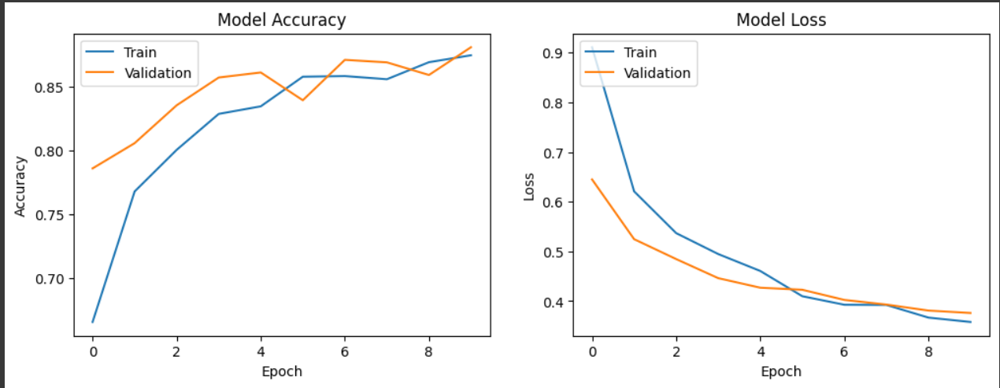
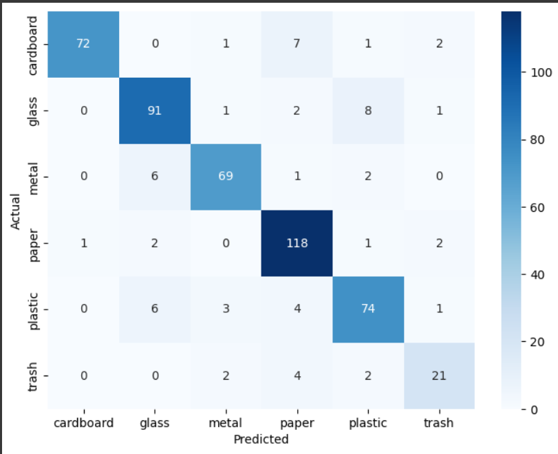

# Model Performance Report

## 1. Summary

This report details the performance of the trained scrap classification model. The model is a fine-tuned MobileNetV2 architecture, which was trained for 10 epochs. It achieved a final validation accuracy of **88.12%**. The detailed metrics below show its performance across all six material classes.

## 2. Training History

The following graphs show the model's accuracy and loss on both the training and validation datasets over the 10 epochs.

**

## 3. Evaluation Metrics

The following report shows the precision, recall, and f1-score for each class.

               precision    recall  f1-score   support
         

    cardboard      0.99      0.87      0.92        83
       glass       0.87      0.88      0.88       103
       metal       0.91      0.88      0.90        78
       paper       0.87      0.95      0.91       124
     plastic       0.84      0.84      0.84        88
       trash       0.78      0.72      0.75        29

    accuracy                           0.88        505
    macro avg       0.87      0.86      0.87       505
    weighted avg    0.88      0.88      0.88       505

## 4. Confusion Matrix

The confusion matrix provides a visual breakdown of the model's correct and incorrect predictions.

Confusion Matrix:

